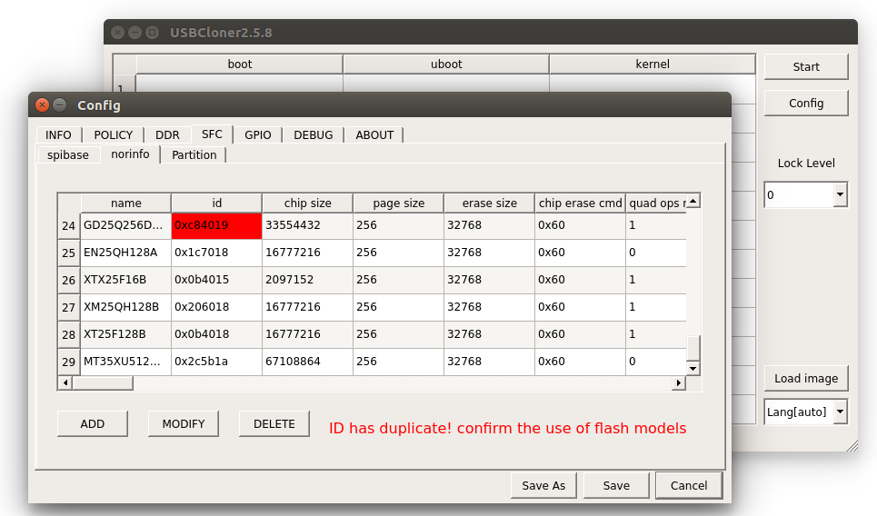

# 1.SFC模块简介

## 1.1.SFC控制器是spi master设备，用来控制spi flash。支持CPU模式和DMA模式传输。

* 支持CDT命令传输模式。
* 支持DMA descriptor chain数据传输模式。
* 支持硬件polling flash的状态。
* 支持Standard, Dual, Quad, Octal SPI等多种传输协议。

## 1.2.GPIO接口

```c
    x2000 SFC共支持两组GPIO:
        PD1.8V:
            SFC0：PD17-22 FUNCTION1
            SFC1：PD23-26 FUNCTION1
        PE3.3V:
            SFC0：PE16-21 FUNCTION0
```

注: *PD组只可以单独配置SFC0或者同时配置SFC0、SFC1为8线，SFC1不可单独使用。*

# 2.内核空间

## 2.1.源码位置

* sfc相关驱动源码

```c
kernel/drivers/mtd/devices/ingenic_sfc_v2/
├── ingenic_sfc_common.c
├── ingenic_sfc_nand.c
├── ingenic_sfc_nor.c
├── ingenic_sfc_ops.c
└── nand_device
    ├── ato_nand.c
    ├── dosilicon_nand.c
    ├── foresee_nand.c
    ├── gd_nand.c
    ├── mxic_nand.c
    ├── nand_common.c
    ├── xtx_mid0b_nand.c
    ├── xtx_nand.c
    └── zetta_nand.c
```

## 2.2. 设备树配置

* 设备树

```c
&sfc {
         status = "okay";
         pinctrl-names = "default";
         pinctrl-0 = <&sfc_pe>;
         ingenic,sfc-max-frequency = <320000000>;   /*sfc外部时钟频率为(sfc-max-frequency/4)Hz*/
         ingenic,use_board_info = /bits/ 8 <0>;  /*是否使用platform_data传参, 需要自己添加platform data*/
         ingenic,spiflash_param_offset = <0>;   /*flash传参时,flash参数的位置; 定义为0时,使用宏SPIFLASH_PARAMER_OFFSET*/
 };
```

## 2.3. 驱动配置

* 添加内核sfc驱动配置

```C
Device Drivers  --->
    <*> Memory Technology Device (MTD) support  --->
        <*>   Command line partition table parsing
        <*>   OpenFirmware partitioning information support
        <*>   Caching block device access to MTD devices
              Self-contained MTD device drivers  --->
                <*> Ingenic series SFC driver
                Select Ingenic series SFC driver version (Use ingenic sfc driver version 2)  --->
                    ( ) Use ingenic sfc driver version 1
                    (X) Use ingenic sfc driver version 2    /* x2000 选择 version 2 */
                the SFC external memory (nor or nand) (Support ingenic sfc-nand)  --->
                    ( ) Support ingenic sfc-nor     /* 使用spi nor时选上 */
                    (X) Support ingenic sfc-nand    /* 使用spi nand时选上 */
        -*-   NAND Device Support  --->     /* 使用spi nand时选上 */
        <*>   Enable UBI - Unsorted block images  --->  /* 使用spi nand时选上 */
            (4096) UBI wear-leveling threshold
            (20)  Maximum expected bad eraseblock count per 1024 eraseblocks
    [*] Block devices  --->
```

# 3、用户空间

## 3.1. 测试脚本

> x2000_v12/packages/example/Sample/SampleSet/StorageMedia-Test.sh

## 3.2. 设备节点

* SFC驱动加载成功

```c
[    0.137842] Enter 'CDT' mode.
[    0.140946] Enter 'DMA Descriptor chain' mode.
[    0.145540] create CDT index: 0 ~ 4,  index number:5.
[    0.150844] ingenic-sfc 13440000.sfc: Found Supported device, id_manufactory = 0xc8, id_device = 0xb1
[    0.160383] use nand common get feature interface!
[    0.165330] create CDT index: 5 ~ 22,  index number:18.
[    0.170748] Scanning device for bad blocks
[    0.261836] Bad eraseblock 1023 at 0x000007fe0000
[    0.266874] Creating 4 MTD partitions on "sfc_nand":
[    0.272012] 0x000000000000-0x000000100000 : "uboot"
[    0.277792] 0x000000100000-0x000000900000 : "kernel"
[    0.293592] 0x000000900000-0x000003100000 : "rootfs"
[    0.309362] 0x000003100000-0x000008000000 : "data"
```

* 设备节点

```c
mtd字符设备节点:
/dev/mtd*

块设备节点:
/dev/mtdblock*
```

## 3.3. 测试方法

* flash读写测试
  
1. 执行脚本: StorageMedia-Test.sh

```c
#./StorageMedia-Test.sh 
**********************************************
* * Please input which module you want test .
**********************************************
* Enter  1 : Read/Write test in the nand/nor .
* Enter  2 : Read/Write test in the sdcard .
* Enter  3 : Read/Write test in the ddr .
* Enter  4 : Read/Write test between nand/nor and sdcard .
* Enter  5 : Read/Write test between nand/nor and ddr .
* Enter  6 : Read/Write test between ddr and sdcard .
```
  
2. 输入1

```c
You select 1, nand/nor <-> nand/nor
***************************************************
* * Please choice which Size you want copy .
***************************************************
* Enter  1 : auto random Size
* Enter  2 : setting a fix Size
```

3. 输入1或输入2

```c
选择1:测试随机大小的数据(根据flash剩余空间,自己计算大小)
选择2:测试指定大小的数据(Kbyte)
```

4. flash读写测试开始,连续测试一段时间,如果无error异常退出则正常。

# 4、添加一款新的flash参数支持

## 4.1.添加spi nor flash参数

* 通过cloner烧录工具添加spi nor flash参数:

  1. 打开cloner中的`Config`，在`INFO`菜单下，选择`Board`为“x2000_v12_sfc_nor_lpddr3_linux.cfg”。
  2. 在`SFC`菜单下，选择二级菜单`norinfo`，选择`ADD`。
  3. 在弹出的对话框中按照spi nor flash的参数填上保存即可。



## 4.2.添加spi nand flash参数

### 4.2.1.添加nand flash厂商支持

* 各厂商nand flash参数配置文件位置

```c
kernel/drivers/mtd/devices/ingenic_sfc_v2/nand_device/
```

* 如果存在该厂商的配置文件，则跳过此步骤；如果不存在，则需要参照其他厂商的参数配置文件，编写自己的配置文件。
  
```c
例如: cp gd_nand.c myflash_nand.c;  vi myflash_nand.c
```

* flash参数配置文件主要构成（例如gd_nand.c）

```c
/* 1. flash支持型号的个数　*/
define GD_DEVICES_NUM          7

/* 2． flash的基础参数　*/
static struct ingenic_sfcnand_base_param gd_param[GD_DEVICES_NUM] = {
    [0] = { ...},
}

/* 3. flash的id和参数建立关联 */
static struct device_id_struct device_id[GD_DEVICES_NUM] = {
    DEVICE_ID_STRUCT(0xD1, "GD5F1GQ4UB",&gd_param[0]),
    ...
}

/* 4. flash获取默认的cdt参数，并根据id更新参数*/
static cdt_params_t *gd_get_cdt_params(struct sfc_flash *flash, uint8_t device_id){
    ...
}

/* 5. 使用通用的get feature接口，需要定义处理ecc的接口　*/
static inline int deal_ecc_status(struct sfc_flash *flash, uint8_t device_id, uint8_t ecc_status){
    ...
}

/* 6.注册flash参数　*/
static int __init gd_nand_init(void) {
    ...
}
```

### 4.2.2.添加nand flash型号支持

* 需要对照flsah手册，完成以下步骤
    1. 添加flash基础参数．

    ```c
        [6] = {.pagesize = 2 * 1024, ... },
    ```

    2. 建立flash与参数的关联

    ```c
       DEVICE_ID_STRUCT(0xA1, "GD5F1GQ4RF",&gd_param[6]),
    ```

    3. 根据id,更新默认参数

    ```c
        case 0xA1:
            gd_nand->cdt_params.standard_r.addr_nbyte = 3;
            gd_nand->cdt_params.quad_r.addr_nbyte = 3;
            break;
    ```

    4. 在处理ecc的接口中添加对应型号的处理

    ```c
        switch(device_id) {
            case 0xA1:
                ．．．
        }
    ```

    1. 将支持flash总数＋１

    ```c
        #define GD_DEVICES_NUM          7
    ```

### 4.2.3.对照flash手册比较默认参数，更新参数

* 默认command参数文件:

```c
u-boot/drivers/mtd/devices/jz_sfc_v2/nand_device/nand_common.h
```

* 制作参数接口说明:

```c
    控制flash相关:
  /*CMD_INFO(_CMD, flash命令, dummy bits, 地址长度, 传输协议)*/
  
  　读flash状态的参数
  /*ST_INFO(_ST, flash命令, status偏移bit, status状态位的mask, status状态位的期望值, 传输长度, dummy bits)*/
```

*例如:*

| Command Name        | Byte 1 | Byte 2    | Byte 3 | Byte 4 | Byte 5    | Byte N    |
| ------------------- | ------ | --------- | ------ | ------ | --------- | --------- |
| Read From Cache x 4 | 6BH    | dummy (2) | A15-A8 | A7-A0  | dummy (2) | (D7-D0)x4 |

```c
/*dummy 8bit, 地址长度３，传输协议对应sfc手册:TM_QI_QO_SPI*/
CMD_INFO(cdt_params.quad_r, SPINAND_CMD_RDCH_X4, 8, 2, TM_QI_QO_SPI);
```

| Register | Addr. | 7        | 6     | 5     | 4     | 3      | 2      | 1   | 0   |
| -------- | ----- | -------- | ----- | ----- | ----- | ------ | ------ | --- | --- |
| Status   | C0H   | Reserved | ECCS2 | ECCS1 | ECCS0 | P_FAIL | E_FAIL | WEL | OIP |

```c
/*OIP便宜bit是０, status状态位mask是0x1, 期望值0x0，传输长度１byte, get feature dummy 0bit*/
ST_INFO(cdt_params.oip, SPINAND_CMD_GET_FEATURE, 0, 0x1, 0x0, 1, 0);
```

* 默认command参数如下

```c
/*
 * cdt params
 */
#define CDT_PARAMS_INIT(cdt_params) {   \
        /* read to cache */                                                     \
        CMD_INFO(cdt_params.r_to_cache, SPINAND_CMD_PARD, 0, 3, TM_STD_SPI);    \
        /* standard read from cache */                                          \
        CMD_INFO(cdt_params.standard_r, SPINAND_CMD_FRCH, 8, 2, TM_STD_SPI);    \
        /* quad read from cache*/                                               \
        CMD_INFO(cdt_params.quad_r, SPINAND_CMD_RDCH_X4, 8, 2, TM_QI_QO_SPI);   \
        /* standard write to cache*/                                            \
        CMD_INFO(cdt_params.standard_w_cache, SPINAND_CMD_PRO_LOAD, 0, 2, TM_STD_SPI);  \
        /* quad write to cache*/                                                \
        CMD_INFO(cdt_params.quad_w_cache, SPINAND_CMD_PRO_LOAD_X4, 0, 2, TM_QI_QO_SPI); \
        /* write exec */                                                        \
        CMD_INFO(cdt_params.w_exec, SPINAND_CMD_PRO_EN, 0, 3, TM_STD_SPI);      \
        /* block erase */                                                       \
        CMD_INFO(cdt_params.b_erase, SPINAND_CMD_ERASE_128K, 0, 3, TM_STD_SPI); \
        /* write enable */                                                      \
        CMD_INFO(cdt_params.w_en, SPINAND_CMD_WREN, 0, 0, TM_STD_SPI);          \
        \
        /* get frature wait oip not busy */                                     \
        ST_INFO(cdt_params.oip, SPINAND_CMD_GET_FEATURE, 0, 0x1, 0x0, 1, 0);    \
}
```

* 参数更新(例如gd_nand.c)

```c
static cdt_params_t *gd_get_cdt_params(struct sfc_flash *flash, uint8_t device_id) {
    switch(device_id) {
        ...
        case 0xA1:
            gd_nand->cdt_params.standard_r.addr_nbyte = 3; /*地址长度更新为3byte*/
            gd_nand->cdt_params.quad_r.addr_nbyte = 3;/*地址长度更新为3byte*/
            break;
        ...
}
```

### 4.2.4.默认get_feature接口以及如何实现自己的接口

* 默认get feature接口位置:

```c
u-boot/drivers/mtd/devices/jz_sfc_v2/nand_device/nand_common.c
```

* 使用默认的get feature接口需要定义自己的处理ecc的接口
  
```c
static inline int deal_ecc_status(struct sfc_flash *flash, uint8_t device_id, uint8_t ecc_status) {
    switch(device_id) {
        case 0xA1:
            case 0xB1 ... 0xB4:
            switch((ecc_status >> 4) & 0x7) {
                case 0x7:
                    ret = -EBADMSG;
                    break;
                case 0x6:
                    ret = 0x8;
                    break;
                case 0x5:
                    ret = 0x7;
                    break;
                default:
                    ret = 0;
            }
            ...
            break;
}
```

* 特殊情况需要自己定义get feature接口

  1. 在flash参数的配置文件中定义自己的get＿feature接口
  2. 将自己定义的接口注册到参数中

```c
int32_t my_get_feature(struct sfc_flash *flash, uint8_t flag) {
    ...
}

static int __init gd_nand_init(void) {
        ...
        /* use private get feature interface, please define it in this document */
        //gd_nand->ops.get_feature = NULL;
        gd_nand->ops.get_feature = my_get_feature();
        ...
}
```
